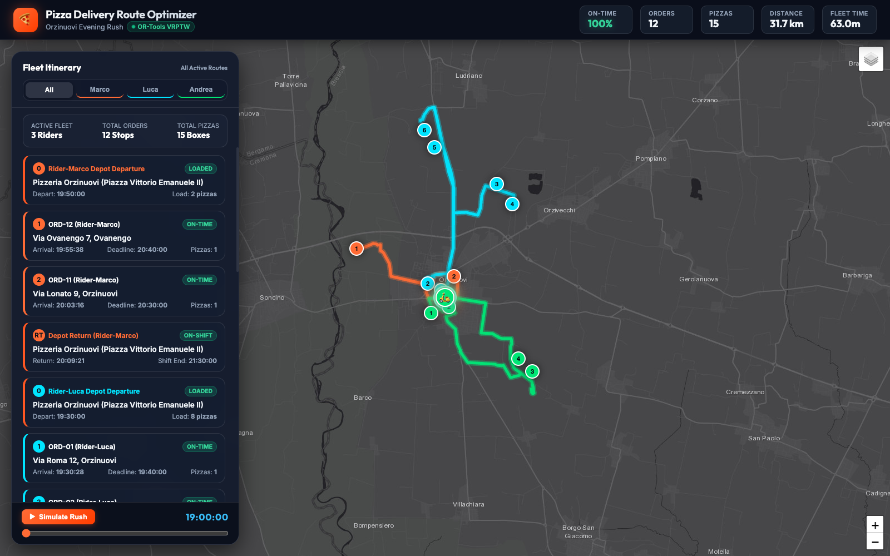

# 🍕 Pizza Delivery Route Optimizer


## 📌 Overview
The **Pizza Delivery Route Optimizer** is a Java-based application designed to solve the Vehicle Routing Problem (VRP) for pizza delivery. 
It calculates the most efficient routes for delivery drivers, ensuring that pizzas are delivered as quickly as possible while minimizing the total distance and travel time. The application outputs an interactive HTML map for easy visualization of the optimized routes.

<p align="center">
  
</p>

## ✨ Key Features
- **Route Optimization:** Utilizes **Google OR-Tools** to compute the optimal delivery routes.
- **JSON Data Processing:** Seamlessly parses input orders and locations using **Jackson**.
- **Interactive Visualization:** Automatically generates an interactive map (`delivery-map.html`) to visualize the delivery points and calculated paths.
- **High Test Coverage:** Business logic and algorithms are tested using **JUnit 5**.

## 🛠️ Technology Stack
- **Language:** Java 21
- **Build Tool:** Maven
- **Core Optimization Engine:** Google OR-Tools
- **JSON Parsing:** Jackson (`jackson-databind`, `jackson-datatype-jsr310`)
- **Testing:** JUnit 5

## 🚀 Getting Started

### Prerequisites
Make sure you have the following installed on your local machine:
- **Java Development Kit (JDK) 21**
- **Maven** (The project includes a Maven Wrapper `mvnw`, so a local Maven installation is optional).

### Installation & Execution

1. **Clone the repository:**
   ```bash
   git clone https://github.com/StefanM14/PizzaDelivery.git
   cd PizzaDelivery
   ```

2. **Build the project:**
   Compile the code and download the required dependencies (like Google OR-Tools).
   ```bash
   ./mvnw clean install
   ```

3. **Run the application:**
   You can easily run the main application using the Maven Exec plugin:
   ```bash
   ./mvnw exec:java
   ```
   
   *(Alternatively, run the `it.delivery.optimizer.App` main class from your IDE).*

4. **View the Results:**
   Once the application has finished executing, open the generated `delivery-map.html` file in your preferred web browser to see the optimized routes!

### Running Tests
To run the JUnit 5 test suite and verify the application's integrity, execute:
```bash
./mvnw test
```

## 🧠 How it Works
The application models the delivery process as a Capacitated Vehicle Routing Problem (CVRP). 
1. **Input:** The system reads delivery locations and order details.
2. **Distance Matrix:** A matrix representing the travel cost (distance/time) between all points is generated.
3. **Optimization:** Google OR-Tools calculates the best assignment of orders to drivers, minimizing the global cost.
4. **Output:** The optimized routes are printed to the console and exported into a visual HTML format.

## 🤝 Contributing
Contributions, issues, and feature requests are welcome! Feel free to check the [issues page](https://github.com/StefanM14/PizzaDelivery/issues).

## 📝 License
This project is open-source and available under the [MIT License](LICENSE).
